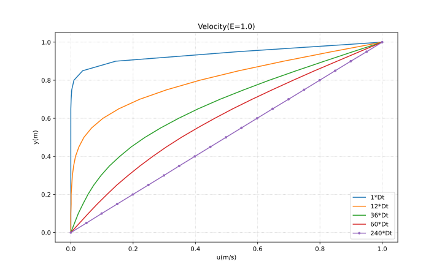
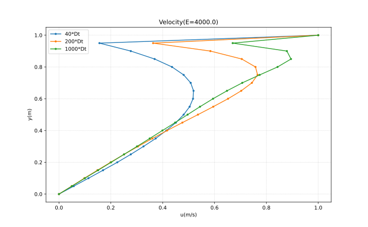

# Anderson's CFD Chap9(C++)

这个仓库是安德森《计算流体力学基础及其应用》第9章算例的C++实现。

其中`Couette1.cpp`为使用了克兰克-尼科尔森算法的求解方法(追赶法解线性方程组的函数包含在`Thomas.h`中)

`Couette2.cpp`为使用了压力修正法的求解方法。

容易验证计算结果收敛到与解析解一致(即u随y线性变化)

## 计算结果展示

E=1.0时速度分布随迭代次数变化:

E=4000.0时几乎得不到有效的速度剖面:

